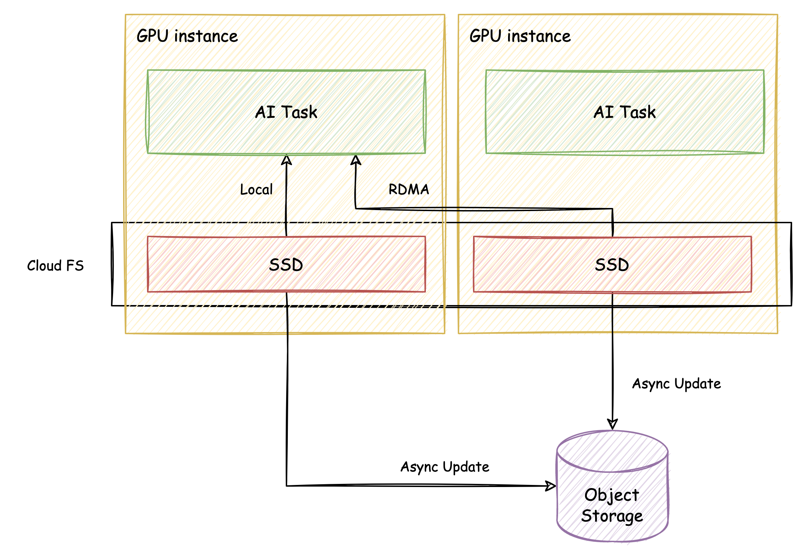

# veTurboIO


[En](./README.md) | [中文](./README.zh.md)


A Python library for high-performance reading and writing of PyTorch model files 
developed by Volcano Engine. This library mainly implements based on the safetensors 
file format to achieve efficient storage and reading of tensor data.

## Install

It can be installed directly through the following way:
```bash
cd veturboio
python setup.py get_libcfs
python setup.py install
```

Tips: This instruction will preferentially download the whl file that matches the 
current Python and PyTorch versions. If no matching whl file is found, it will 
automatically download the source code for compilation and installation.


If the installation fails, you can also try to install by downloading the source code, 
and then compile and install it manually.

```bash
# CUDA ops, default
python setup.py install --cuda_ext

# NPU ops
python setup.py install --npu_ext

# CPU only
python setup.py install --cpu_ext
```


## Quick Start

### Read and write model files


```python
import torch
import veturboio

tensors = {
   "weight1": torch.zeros((1024, 1024)),
   "weight2": torch.zeros((1024, 1024))
}

veturboio.save_file(tensors, "model.safetensors")

new_tensors = veturboio.load("model.safetensors")

# check if the tensors are the same
for k, v in tensors.items():
    assert torch.allclose(v, new_tensors[k])
```

### Convert existing PyTorch files

```bash
python -m veturboio.convert -i model.pt -o model.safetensors
```

## Performance test

Run directly:
```bash
bash bench/io_bench.sh
```
Then, you can get the following results:
```
fs_name    tensor_size     veturboio load_time(s)             torch load_time(s)
shm        1073741824      0.08                               0.63
shm        2147483648      0.19                               1.26
shm        4294967296      0.36                               2.32
```

Also, you can run the following command to get more options:
```bash
python bench/io_bench.py -h
```

## Advance Features

### Using veMLP to accelerate reading and writing
Volcano Engine Machine Learning Platform (veMLP) provides a distributed cache file system
based on the physical disks of the GPU cluster. 

<p align="center">
    
</p>

When a cluster-level task needs to read 
a model file, the caching system can efficiently distribute the model file between GPU 
machines via RDMA transfer, thus avoiding network transfer bottlenecks. When using this 
system, veTurboIO can maximize its performance advantages.

### Encrypt and decrypt model files
veTurboIO supports encryption and decryption of model files. You can read the [tutorial](./docs/encrypt_model.md) 
to learn how to keep your model files secure. When you use GPU as target device, veTurboIO can decrypt the model file on the fly.


## License

[Apache License 2.0](./LICENSE)

